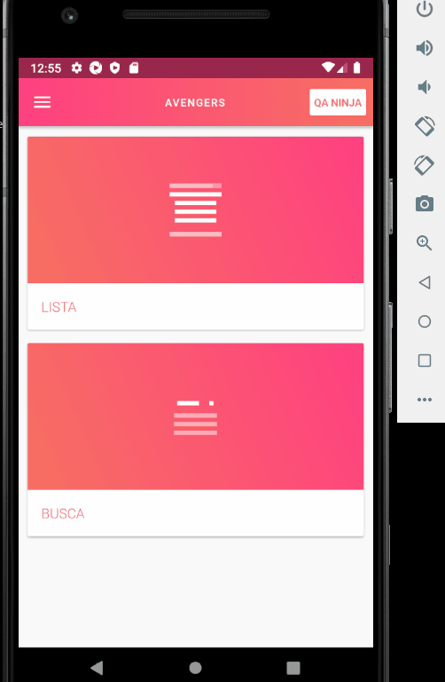

# Automação mobile

O projeto aborda uma automação de testes de aplicação mobile voltado para Android (por enquanto).

## Sobre o projeto

Aplicação consiste em um menu com as opções de forms, dialogs, seek bar, inputs e botões, onde ao clicar em uma dessas opções irá aparecer uma lista para o usuário escolher.

## Layout Mobile

## Tecnologias utilizadas 

- Appium
- Cucumber 
- Ruby
- Allure Report

## Ferramentas 

- Android Studio
- Appium Desktop
- Visual Studio Code ou alguma ide de sua preferência

## Passos para executar o projeto - Android

1 - Primeiramente devemos instalar o ruby: https://www.ruby-lang.org/en/downloads/ 

2 - Posteriormente instalar o jdk8: https://www.oracle.com/java/technologies/javase/javase-jdk8-downloads.html 

3 - Com o java 8 instalado, fazer o download do android studio: https://developer.android.com/studio

4 - Depois do java e android studio já configurado vamos instalar o Node.js: https://nodejs.org/pt-br/

5 - Com o node instalado, abra o cmd/terminal e execute o seguinte comando: npm appium -g

6 - Appium instalado, iremos instalar o appium doctor com o seguinte comando: npm appium-doctor -g

7 - Feito o passo acima digite comando appium-doctor --android esse comando irá verificar se tudo foi configurado corretamente

8 - Instalar o Appium Desktop: https://github.com/appium/appium-desktop/releases

9 - Abra o Android Studio e crie um dispositivo virtual: https://developer.android.com/studio/run/managing-avds?hl=pt-br

10 - Abra o Appium Desktop e clique no botão Start Server, assim que for executado clique na opção de Start Inspector Session no ícone de lupa irá abrir uma nova tela, vá em Desired  Capabilities coloque em Name e Value os seguintes valores:

  * automationName - UiAutomator2
  * platformName - Android
  * deviceName - Emulator
  * app - ${path}\twp-cucumber-ruby-mobile\app\twp.apk - path é o caminho onde você baixou o projeto.
  * uid - device - para saber o dispositivo que esta sendo executado, abra o cmd/terminal e digite o comando adb devices, copie o valor abaixo da List of devices

11 - Feito isso clique na opção Save as defina um nome e clique em Save, em seguida clique na opção Start Session, com o Android Studio ja aberto com o dispositivo virtual, o arquivo .apk será executado.

12 - Assim que for executado devemos baixar as depedências do Ruby vá para a pasta do projeto no cmd/terminal e digite o comando bundle install, concluído a instalação execute comando
cucumber no cmd/terminal, ele irá executar todos os casos de testes.

13 - Caso queira realizar a execução por arquivo basta ir no cmd/terminal digitar o comando cucumber features\specs\arquivo.feature

14 - Caso queira realizar a execução por cenário bastar digitar o comando cucumber -t @nomedoCenário  definidos no arquivos .feature, agora caso opte por executar todos os cenários basta digitar no cmd/terminal cucumber.

15 - Assim que for executado o teste e quiser visualizar o relatório do Allure basta digitar o comando allure serve logs que o relatório será aberto navegador.

